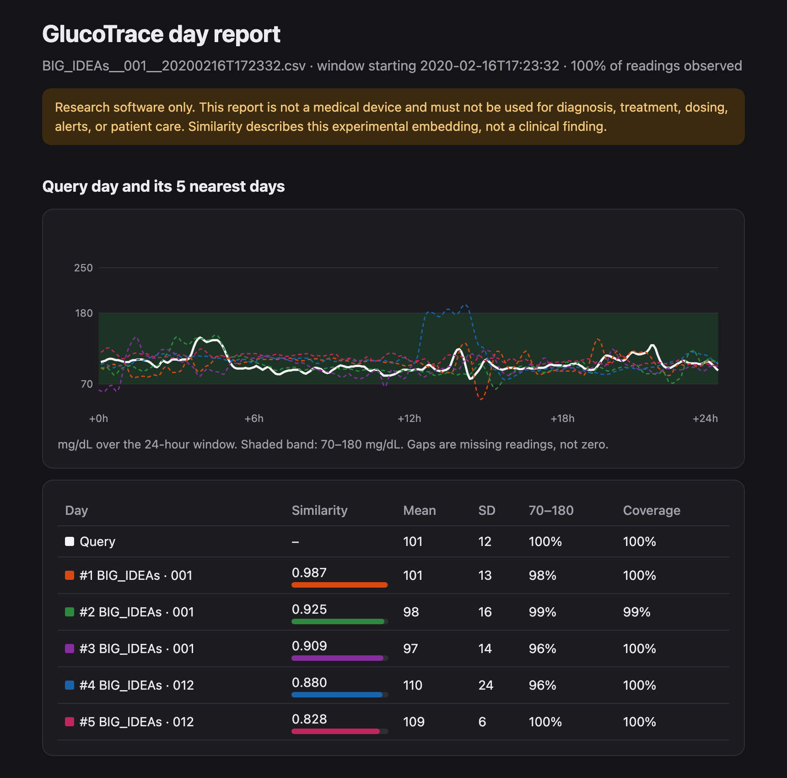

# GlucoTrace

**Turn a day of continuous glucose monitor (CGM) data into a 128-number
fingerprint, then compare it with, search for, and visualize similar days.**

[](https://github.com/Aman-Tripathi27/GlucoTrace/actions/workflows/tests.yml)
[](https://pypi.org/project/glucotrace/)


GlucoTrace is a small, readable PyTorch Transformer (511k parameters) for
representation learning on CGM time series. It trains on public data, never
invents missing glucose readings, and reports its results honestly: every
release decision follows an evaluation protocol written down *before*
training, including the failures.

> **Research software only.** GlucoTrace is not a medical device and must not
> be used for diagnosis, treatment, dosing, alerts, or patient care.

<p align="center">
  
  <br><sub><code>glucotrace report</code> output for a public BIG IDEAs day
  (PhysioNet, ODC-By 1.0). The top three matches are other days from the same
  participant.</sub>
</p>

## Quickstart

```bash
pip install glucotrace
glucotrace download-model       # fetches the 2 MB checkpoint, verifies SHA-256
glucotrace encode my-day.csv --output fingerprint.json      # 128-number fingerprint
glucotrace compare monday.csv tuesday.csv                    # cosine similarity
glucotrace report my-day.csv \
  --manifest data/processed/big_ideas/manifest.json \
  --output report.html                                       # offline visual report
```

The input is a CSV with `timestamp,glucose` columns in mg/dL, or pass
`--unit mmol/L`. Files whose values contradict the declared unit are rejected
rather than silently misread. Run `glucotrace --help` for all thirteen commands.
In Python, `import glucotrace` exposes the same API as `glucofm`.

## Why GlucoTrace

- **Missing data stays missing.** Gaps are tracked with an explicit
  observation mask and gap age; nothing is interpolated.
- **Leakage-resistant by construction.** Participant-disjoint splits are tied
  to checksummed manifests, and the loader refuses stale splits.
- **Pre-registered evaluation.** Thresholds, probes, and candidate budgets are
  declared before training; a test partition is opened once.
- **Beats a transparent baseline.** On validation, the embedding predicts the
  mean glucose of a hidden 6-hour window with lower error than 11 hand-built
  summary statistics (7.7 vs 8.2 mg/dL, released checkpoint).
- **Honest about its weak spot.** The embedding still reveals which dataset a
  day came from. [Protocol 1.2](PROTOCOL_1_2_RESULTS.md) traced this to clock
  alignment, and [protocol 1.3](PROTOCOL_1_3_RESULTS.md) confirmed it: starting
  every day at midnight halved the leakage, at a cost in usefulness that is
  still being investigated.
- **Small and hackable.** About 5,000 lines of typed Python, 66 tests, CPU
  training in minutes.

## Results at a glance

| Question | Result | Where |
|---|---|---|
| Is the embedding non-collapsed and stable when data goes missing? | Yes, all five protocol 1.1 checks passed on a held-out test set (e.g. 30% random removal: median cosine 0.994) | [RELEASE_RESULTS.md](RELEASE_RESULTS.md) |
| Is it more useful than summary statistics? | Yes on validation: 4 to 13% lower hidden-window error for 5 of 6 new candidates | [PROTOCOL_1_2_RESULTS.md](PROTOCOL_1_2_RESULTS.md) |
| Does it encode which dataset a day came from? | Yes, too much (linear probe 0.88 to 0.98). Aligning days to midnight halved the excess (margin 0.19 to 0.10) but cost usefulness | [PROTOCOL_1_2_RESULTS.md](PROTOCOL_1_2_RESULTS.md), [PROTOCOL_1_3_RESULTS.md](PROTOCOL_1_3_RESULTS.md) |
| Can a fingerprint link days from the same person? | Often: top-1 same-person match about 25% vs 3.5% chance. Treat fingerprints as personal data | [MODEL_CARD.md](MODEL_CARD.md) |
| Is it clinically validated? | **No.** No clinical, diagnostic, or safety claim is made | [MODEL_CARD.md](MODEL_CARD.md) |

The repository is branded **GlucoTrace**. The original `glucofm` import
package, model class, and `glucofm-*` commands remain for compatibility.

## Prepare public datasets

The BIG IDEAs adapter reads the official PhysioNet participant layout and emits
provenance-tracked 24-hour CGM files:

```bash
glucofm-prepare-big-ideas big-ideas-1.1.3 prepared/big-ideas
```

Only the small `Dexcom_*.csv` files are required. The source dataset is not
bundled or automatically downloaded. See [DATA.md](DATA.md) for its license,
expected layout, canonical schema, and exact processing rules.

The Colas adapter reads the authoritative PLOS Supporting File S1 ZIP directly:

```bash
glucofm-prepare-colas pone.0225817.s001.zip prepared/colas
```

This source contains only clock times. The adapter preserves clock phase,
reconstructs nominal five-minute spacing from source row order, and labels the
calendar date as a documented relative placeholder. It ignores the accompanying
clinical table because the encoder requires only CGM. See [DATA.md](DATA.md) for
the exact transformation and attribution.

## Create leakage-resistant dataset splits

Generate a deterministic participant-level split tied to the exact manifest:

```bash
glucofm-split-corpus prepared/big-ideas/manifest.json
```

The default split uses the seed and participant key to create a stable SHA-256
ordering, then assigns 70% of participants to training, 15% to validation, and
the remainder to testing. The resulting `splits.json` stores the manifest
SHA-256, seed, fractions, participant membership, and day counts. If the
manifest changes later, the dataset loader rejects the stale split.

```python
from glucofm import CanonicalCGMDataset

train_days = CanonicalCGMDataset(
    "prepared/big-ideas/manifest.json",
    split_path="prepared/big-ideas/splits.json",
    split="train",
)

sample = train_days[0]
print(sample["glucose"].shape)       # [288]
print(sample["time_of_day"].shape)  # [288, 2]
```

Checksums are verified by default. Splitting uses `(dataset, participant_id)` as
the group key, so days from one declared participant cannot cross partitions.

## What it does

1. Reads a CSV containing ISO-8601 timestamps and glucose values.
2. Places measurements on a regular grid and retains an explicit missing-data
   mask. Missing values are not interpolated.
3. Builds causal masked averages over 15-minute, 60-minute, and 180-minute
   histories to form the **slow-trend stream**.
4. Subtracts the 60-minute trend from observed glucose and calculates valid
   adjacent changes to form the **rapid-event stream**.
5. Groups 12 five-minute readings into each hourly patch, projects the two
   streams separately, and joins them into a 128-value token.
6. Applies a three-layer Transformer to 24 hourly tokens, then combines their
   global mean, global variation, and four six-hour segment means into a
   128-value day embedding.

The default network has 3 Transformer layers, a hidden size of 128, 4 attention
heads, a feed-forward size of 256, and 511,372 trainable parameters. It is a
small research implementation, not a claim of foundation-model scale or
performance.

## Install

```bash
python -m pip install -e '.[dev]'
```

Python 3.10+, NumPy, and PyTorch 2.1+ are required.

## CSV format

```csv
timestamp,glucose
2026-01-01T00:00:00Z,104
2026-01-01T00:05:00Z,108
2026-01-01T00:10:00Z,
2026-01-01T00:15:00Z,111
```

Timestamps may be timezone-aware or naive, but a file must not mix the two.
Rows can be out of order. Empty glucose cells and absent grid times are missing.
By default the first timestamp anchors a 5-minute grid and each later timestamp
must be within 2 minutes of its nearest grid point.

## Encode, compare, search, and report

```bash
glucofm-encode day.csv --output day.fingerprint.json
glucofm-compare first-day.csv second-day.csv --output comparison.json
glucofm-search query-day.csv \
  --manifest data/processed/big_ideas/manifest.json \
  --top-k 5 --output nearest-days.json
glucofm-report query-day.csv \
  --manifest data/processed/big_ideas/manifest.json \
  --output report.html
```

The report is one self-contained HTML file with inline SVG. It loads no
scripts or network resources, so it opens offline and can be attached to an
email. Missing readings are drawn as gaps.

The encode command produces a validation-standardized, unit-length 128-number
fingerprint. Compare reports cosine similarity without assigning a clinical
meaning or threshold. Search verifies canonical checksums and returns ranked
provenance; exact self-matches are excluded by default. See
[INFERENCE.md](INFERENCE.md) for the input contract, multi-window behavior,
Python API, output schemas, and privacy limitations.

## Architecture API

```python
from glucofm import CGMWindowDataset, GlucoTrace, load_cgm_csv

series = load_cgm_csv("cgm.csv", interval_minutes=5)
windows = CGMWindowDataset(series, window_size=288, stride=72)

model = GlucoTrace()
sample = windows[0]
result = model(
    sample["glucose"],
    sample["observed_mask"],
    sample["gap_age_minutes"],
    sample["time_of_day"],
)

print(result["embedding"].shape)         # [24, 128] hourly tokens
print(result["pooled_embedding"].shape)  # [128] day embedding
print(result["reconstruction"].shape)    # [288]
```

Model inputs remain in mg/dL. Internally, observed glucose is transformed by the
fixed, documented numerical scaling `(glucose - 120) / 40`; these constants are
not estimated from the input day. Missing placeholders are set to zero only
after masking and cannot enter either glucose stream.

## Multi-source latent pretraining

The research training path balances sources rather than allowing the largest
corpus to dominate. It masks complete hourly patches and trains a student to
predict full-context tokens from an exponential-moving-average teacher:

```bash
glucofm-pretrain \
  --corpus data/processed/big_ideas/manifest.json data/processed/big_ideas/splits_protocol_1_1.json \
  --corpus data/processed/colas/manifest.json data/processed/colas/splits_protocol_1_1.json \
  --epochs 40 --batch-size 32 \
  --output checkpoints/glucofm-research.pt
```

The objective predicts masked hourly tokens while making two differently masked
views of one day agree and keeping different days distinguishable. It uses only
physical observations and participant-disjoint training partitions and saves
data checksums and configuration with the weights. See
[TRAINING.md](TRAINING.md) for the loss, sampling, checkpoint, and leakage
details.

## Frozen representation evaluation

Evaluation protocols 1.0 through 1.3 were specified before their corresponding
training decisions. They measure
embedding collapse, controlled missingness stability, retrieval consistency,
and cross-source separability against a transparent summary-feature baseline:

```bash
glucofm-evaluate checkpoints/glucofm-research.pt \
  --corpus data/processed/big_ideas/manifest.json data/processed/big_ideas/splits_protocol_1_1.json \
  --corpus data/processed/colas/manifest.json data/processed/colas/splits_protocol_1_1.json \
  --protocol-version 1.1 \
  --output evaluations/protocol-1.1.json
```

The protocol uses validation data for standardization and aggregate metrics from
participant-disjoint test data. The checkpoint passed protocol 1.1's internal
representation gate, but source predictability remains high. Cross-source
separability is dataset-confounded and is not a sensor-performance result. See
[EVALUATION_1_1.md](EVALUATION_1_1.md) and
[RELEASE_RESULTS.md](RELEASE_RESULTS.md) for the exact boundary and limitations.

Protocol 1.2 (`--protocol-version 1.2`) adds three probes, each fitted on
training data: a linear source probe, same-participant retrieval, and
hidden-window utility. It also adds two release gates. Source-invariance
training options are available as `--within-source-negatives` and
`--source-adversary-weight`. See [EVALUATION_1_2.md](EVALUATION_1_2.md) and
[PROTOCOL_1_2_RESULTS.md](PROTOCOL_1_2_RESULTS.md).

## Single-CSV reconstruction smoke test

```bash
glucofm-train cgm.csv --window-size 288 --epochs 5 --output glucofm.pt
```

This older example trainer randomly hides observed values, recomputes gap age from the
reduced visibility mask, and computes mean squared error only at hidden
positions. It saves model weights, configuration, sampling interval, and source
summary statistics. It is retained as a small code example; it is not the
multi-source project objective or a validated training protocol.

## Design notes

- Every trend is mask-normalized and causal: it uses only the current and
  preceding observations. Transformer attention is bidirectional because this
  model encodes a completed day; it is not a real-time forecasting model.
- Trend density, physical observation mask, capped gap age, and circular
  time-of-day are explicit inputs. Missing glucose is never silently presented
  as measured.
- Keeping three trend widths makes the slow/event split inspectable and permits
  direct ablation. The rapid stream uses the one-hour trend as its baseline.
- Sinusoidal patch positions avoid a learned day-length-specific table.
- The reconstruction head is only a small training hook. The intended public
  representation is `pooled_embedding`.

## Tests

```bash
pytest
```

Tests cover grid construction, zero-filled missingness, gap age, windows, model
output shapes, causal trends, placeholder invariance, random masking, gradient
flow, controlled missingness perturbations, embedding diagnostics, retrieval
stability, the source probe, protocol 1.2 probes, source-invariant
training, unit validation, HTML reports, and the `glucotrace` CLI.

## Scope and limitations

The checkpoint has only been evaluated for the declared embedding-collapse and
artificial-missingness checks. It has not been validated for downstream tasks,
external generalization, subgroup behavior, device equivalence, privacy, or
real-world safety. A mask-aware network can still learn dataset artifacts;
indeed, the source probe is a known warning. Glucose units are not inferred or
converted unless `--unit mmol/L` is declared. Fingerprints can link days from
the same person, so treat them as personal data. See
[MODEL_CARD.md](MODEL_CARD.md) before using the code in research.

## License

MIT. See [LICENSE](LICENSE).

## Contributing

Contributions are welcome through focused issues and pull requests. Start with
[CONTRIBUTING.md](CONTRIBUTING.md), which covers development setup, tests,
dataset-adapter provenance, held-out evaluation rules, privacy boundaries, and
the prohibition on clinical claims. Please use synthetic fixtures in tests and
never commit private CGM records.

By participating, contributors agree to follow the
[code of conduct](CODE_OF_CONDUCT.md). Security and private-data problems should
follow [SECURITY.md](SECURITY.md), not a public issue.
